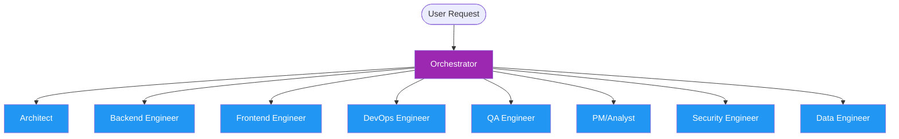

# Core Agent Matrix & Routing Rules

This document outlines the core AI agent team structure, model specifications, tools, and routing priorities for the standard scaffold operating environment.

## Team Structure

---

## Routing Matrix

| Role Name | Agent Key | Default Model | Primary Tools | Scope of Work |
|:---|:---|:---|:---|:---|
| **Orchestrator** | `orchestrator` | `claude-opus-4` | `invoke_subagent`, `list_dir`, `grep_search` | Subagent delegation, task status tracking, cross-agent review |
| **Architect** | `architect` | `claude-sonnet-4` | `view_file`, `write_to_file`, `grep_search` | System design, architectural decision records (ADRs), tech debt monitoring |
| **Backend Engineer** | `backend-engineer` | `claude-sonnet-4` | `run_command`, `replace_file_content` | API structure, database operations, background tasks, unit testing |
| **Frontend Engineer** | `frontend-engineer` | `claude-sonnet-4` | `run_command`, `replace_file_content` | UI components, streaming/playback players, state management, styling |
| **DevOps Engineer** | `devops-engineer` | `claude-sonnet-4` | `run_command`, `write_to_file` | Dockerization, CI/CD pipelines, container orchestration, environment setups |
| **QA Engineer** | `qa-engineer` | `claude-sonnet-4` | `run_command`, `grep_search` | Test plans, end-to-end testing, bug reproduction, code coverage validation |
| **PM/Analyst** | `pm-analyst` | `claude-sonnet-4` | `searchConfluence`, `getJiraIssue` | Requirements gathering, Jira ticket management, documentation |
| **Security Engineer** | `security-engineer` | `claude-sonnet-4` | `grep_search`, `run_command` | Threat modeling, credential scanning, compliance validation, OWASP checks |
| **Data Engineer** | `data-engineer` | `claude-sonnet-4` | `run_command`, `view_file` | Timeseries database optimization, query metrics, ETL pipelines |

---

## Routing Principles

1. **Orchestrator First:** All incoming tasks must first be evaluated by the `orchestrator`.
2. **Surgical Scope:** Tasks must be delegated to the agent with the narrowest scope matching the domain.
3. **No Overlaps:** Do not allocate database migration work to the Frontend Engineer or Next.js styling work to the Backend Engineer.
4. **Escalation Protocol:** If an builder agent hits a blocker (e.g., security check fails or architecture style mismatch), they must yield back to the `orchestrator` for review rather than performing a silent workaround.
