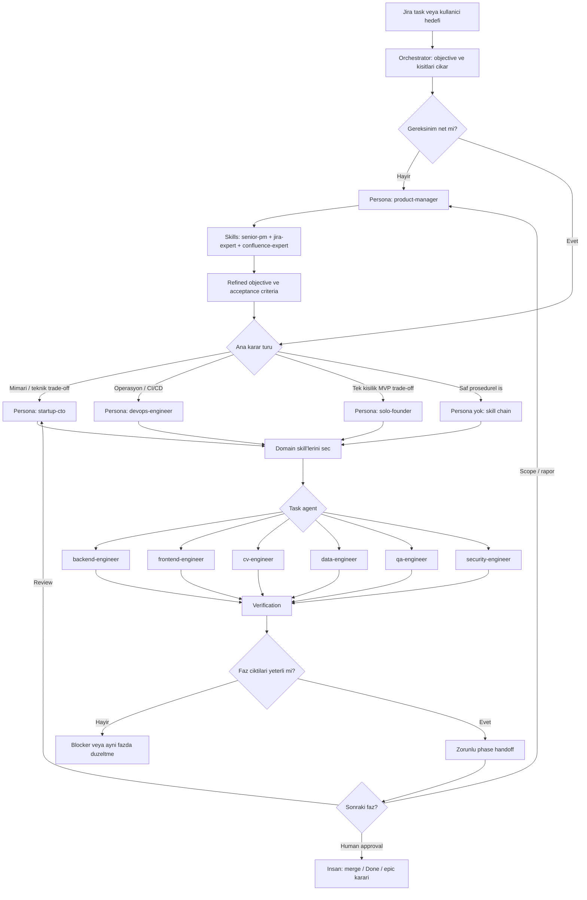

# PaceBuild Agent Orchestration Protocol

Bu dokuman agent ekibinin ana calisma protokoludur.

Kaynak model:
[alirezarezvani/claude-skills ORCHESTRATION.md](ORCHESTRATION.upstream.md).
Bu repo, upstream modelin persona + skill + task agent + phase handoff
yaklasimini PaceBuild, Jira ve worktree kurallariyla birlestirir.

Framework zorunlu degildir. Ilk katman structured prompting ile calisir.
`agentctl` daha sonra bu protokolu otomatik yurutmek icin kullanilan opsiyonel
runtime katmanidir.

## Temel Model

- **Objective:** Ulasilacak sonuc, kisitlar ve basari kriterleri.
- **Persona:** O fazda kimin yargisi ve karar sistemi kullaniliyor.
- **Skills:** Isin nasil yapilacagini belirleyen workflow, script ve referanslar.
- **Task agent:** Tek domain icinde sinirli isi yapan uygulayici.
- **Phase:** Tek persona ve tanimli ciktilarla tamamlanan calisma bolumu.
- **Handoff:** Sonraki faza aktarilan kararlar, artifact'ler ve acik konular.

## Zorunlu Kurallar

1. Ayni anda yalnizca bir persona aktiftir.
2. Bir fazda ihtiyac kadar skill birlikte yuklenebilir.
3. Prosedurel islerde persona kullanmak zorunlu degildir; skill chain yeterlidir.
4. Persona ile task agent ayni sey degildir.
5. Her faz sonunda handoff yazilir.
6. Orchestrator onerir; nihai kapsam, merge, Done ve epic karari insandadir.
7. Jira issue, yorumlar, parent epic ve kabul kriterleri okunmadan kod fazi baslamaz.

## Karar Haritasi



## Persona Katalogu

| Durum | Persona | Dosya |
| --- | --- | --- |
| Urun kapsami, backlog, kabul kriteri | Product Manager | `core/personas/product-manager.md` |
| Mimari, teknik risk, stack, teknik review | Startup CTO | `core/personas/startup-cto.md` |
| CI/CD, container, deployment, monitoring | DevOps Engineer | `core/personas/devops-engineer.md` |
| Tek kisilik MVP, zaman ve kapsam trade-off'u | Solo Founder | `core/personas/solo-founder.md` |

Personalar upstream kaynaktan alinmistir. Bu projede pazarlama, finans ve content
personalarina MVP asamasinda ihtiyac olmadigi icin katalog disinda birakilmistir.

## Task Agent Katalogu

Task agentlar `core/agents/` ve `packs/pacebuild/agents/` altindadir:

- `architect`
- `backend-engineer`
- `frontend-engineer`
- `devops-engineer`
- `qa-engineer`
- `pm-analyst`
- `security-engineer`
- `data-engineer`
- PaceBuild pack ile `cv-engineer`

Task agent, aktif personanin kararlarini ve yuklenen skill'lerin workflow'unu
uygular. Kendi kapsamindan cikamaz.

## Skill Secimi

### Urun ve Jira fazi

```text
Persona: product-manager
Skills:
  - core/agents/pm-analyst/skills/senior-pm/SKILL.md
  - core/agents/pm-analyst/skills/jira-expert/SKILL.md
  - core/agents/pm-analyst/skills/confluence-expert/SKILL.md
Task agent: pm-analyst
```

### Teknik tasarim fazi

```text
Persona: startup-cto
Skills:
  - core/agents/architect/skills/senior-architect/SKILL.md
  - ilgili domain skill'i
Task agent: architect veya ilgili builder
```

### Backend uygulama fazi

```text
Persona: startup-cto
Skills:
  - core/agents/backend-engineer/skills/senior-backend/SKILL.md
  - core/agents/backend-engineer/skills/backend-testing/SKILL.md
Task agent: backend-engineer
```

### PaceBuild CV fazi

```text
Persona: startup-cto
Skills:
  - packs/pacebuild/agents/cv-engineer/skills/senior-computer-vision/SKILL.md
  - packs/pacebuild/agents/cv-engineer/skills/cv-pipeline-checks/SKILL.md
  - packs/pacebuild/agents/cv-engineer/skills/yolo-bytetrack/SKILL.md
Task agent: cv-engineer
```

### Review fazi

```text
Persona: startup-cto
Skills:
  - core/agents/orchestrator/skills/code-review/SKILL.md
  - core/agents/qa-engineer/skills/tdd-guide/SKILL.md
  - risk varsa security-pen-testing
Task agent: qa-engineer veya security-engineer
```

## Standart Fazlar

### Faz 0 - Intake ve Scope

Persona: `product-manager`

Girdiler:

- Jira issue ve tum yorumlar
- Parent epic
- Confluence proje hafizasi
- Kisitlar ve insan yetki sinirlari

Ciktilar:

- Objective
- Non-goals
- Acceptance criteria
- Dependency ve risk listesi
- Sonraki faz icin persona ve skill secimi

### Faz 1 - Teknik Karar

Persona: `startup-cto` veya operasyon agirlikliysa `devops-engineer`

Ciktilar:

- Uygulama plani
- Etkilenen dosyalar
- Teknik kararlar ve trade-off'lar
- Verification plani

### Faz 2 - Uygulama

Persona: Faz 1'de secilen tek persona.

Task agent: En dar domain agenti.

Ciktilar:

- Kod ve konfigurasyon
- Testler
- Artifact listesi
- Bilinen limitler

### Faz 3 - Bagimsiz Review

Persona: `startup-cto`.

Task agent: `qa-engineer`, gerekirse `security-engineer`.

Ciktilar:

- Bulgular
- Test kaniti
- Acceptance criteria sonucu
- Handoff'a hazir / duzeltme gerekli karari

### Faz 4 - PM Handoff

Persona: `product-manager`.

Ciktilar:

- Jira completion veya blocker yorumu
- Confluence hafiza guncellemesi
- Insan onayi bekleyen kararlar
- Sonraki task onerisi

## Zorunlu Handoff Formati

```text
Phase [N] complete.
Objective: [bu fazin hedefi]
Persona: [aktif persona veya none]
Skills: [yuklenen skill listesi]
Task agent: [uygulayici]
Decisions: [alinan kararlar]
Artifacts: [dosyalar, dokumanlar, test ciktilari]
Verification: [calistirilan kontroller ve sonuclari]
Open items: [acik sorular ve blocker'lar]
Switching to: [sonraki persona] + [sonraki skills]
Human approval needed: [evet/hayir ve konu]
```

## Ornek: Jira'dan Gelen Backend Task

```text
Objective: PACE-XYZ acceptance criteria'sini karsilayan endpoint'i teslim et.
Constraints: Epic degistirme, Done yapma, merge etme.
Success criteria: Testler gecer, PR ve Jira handoff hazir.

Phase 0:
  Persona: product-manager
  Skills: jira-expert, senior-pm
  Task agent: pm-analyst

Phase 1:
  Persona: startup-cto
  Skills: senior-architect, senior-backend
  Task agent: architect

Phase 2:
  Persona: startup-cto
  Skills: senior-backend, backend-testing
  Task agent: backend-engineer

Phase 3:
  Persona: startup-cto
  Skills: tdd-guide, code-review
  Task agent: qa-engineer

Phase 4:
  Persona: product-manager
  Skills: jira-expert, confluence-expert
  Task agent: pm-analyst
```

## Otomasyon Runtime'i

`bin/` ve `lib/` altindaki JavaScript dosyalari orchestration modelinin kendisi
degildir. Bu protokolu otomatiklestirmek icin deneysel MVP altyapisidir:

- Jira'dan aday task okuma
- `agent-ready` ve acceptance criteria kontrolu
- Task lock
- Persona/skill route onerisi
- Git worktree plani
- Codex executor cagirma
- Run state kaydi

Structured prompting modeli bunlar olmadan da kullanilabilir. Runtime devre disi
olsa bile bu dokuman ve agent/skill dosyalari calisma protokolunu tanimlar.
