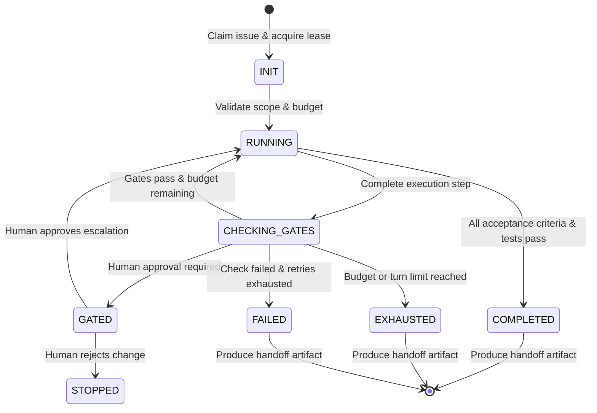

# Bounded Autonomy Contract & State Machine

## State Machine

## Budget Leases

- **Turn Limit**: Maximum execution turns per subtask phase (default: 10 turns).
- **Time Budget**: Maximum duration per execution lease (default: 15 minutes).
- **Token Budget**: Maximum token consumption ceiling before mandatory checkpoint.

## Exit Criteria & Human Gates

1. **Auto-Continue Allowed**: When tests pass, lint checks succeed, and changes remain strictly within the lease boundary.
2. **Escalation Required**: Immediate pause and handoff when:
   - Scope expansion beyond initial Jira ticket is needed.
   - Deleting databases, production credentials, or canonical policy files.
   - Merging branches or marking Jira tickets as Done.
