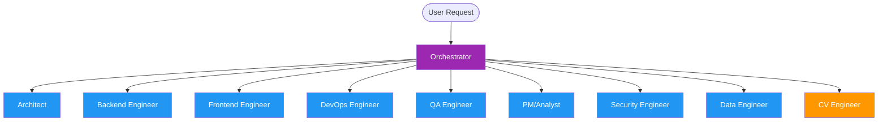

# PaceBuild Agent Matrix & Routing Rules (Extension Override)

This extension override documents the 10-agent team structure, milestones, and specific routing priorities configured for the PaceBuild project.

## PaceBuild Team Structure

---

## Complete Team Matrix

| Role Name | Agent Key | Default Model | Primary Tools | Scope of Work |
|:---|:---|:---|:---|:---|
| **Orchestrator** | `orchestrator` | `claude-opus-4` | `invoke_subagent`, `list_dir` | Overall coordination, task routing, integrations review |
| **Architect** | `architect` | `claude-sonnet-4` | `view_file`, `write_to_file` | System design, ADR patterns, tech debt limits |
| **Backend Engineer** | `backend-engineer` | `claude-sonnet-4` | `run_command`, `replace_file_content` | FastAPI APIs, postgres models, test runs |
| **Frontend Engineer** | `frontend-engineer` | `claude-sonnet-4` | `run_command`, `replace_file_content` | Next.js portal, widgets design, stream viewer UI |
| **DevOps Engineer** | `devops-engineer` | `claude-sonnet-4` | `run_command`, `write_to_file` | Compose containers, dependent check constraints |
| **QA Engineer** | `qa-engineer` | `claude-sonnet-4` | `run_command`, `grep_search` | Pytest backend, Jest client E2E integration validations |
| **PM/Analyst** | `pm-analyst` | `claude-sonnet-4` | `searchConfluence`, `getJiraIssue` | Scope documents, Jira lifecycles, progress reports |
| **Security Engineer** | `security-engineer` | `claude-sonnet-4` | `grep_search`, `run_command` | Threat reviews, OWASP checks, credentials monitoring |
| **Data Engineer** | `data-engineer` | `claude-sonnet-4` | `run_command`, `view_file` | TimescaleDB hypertable partitioning, continuous aggregates |
| **CV Engineer** | `cv-engineer` | `claude-sonnet-4` | `run_command`, `replace_file_content` | YOLOv8 pipeline, ByteTrack tuning, MJPEG server |

---

## Project Milestones

- **Phase A (Walking Skeleton & MVP):**
  - Sprint 1: cv-engine mock events → backend → TimescaleDB, frontend hook setup.
  - Sprint 2: ByteTrack persistence config and MJPEG Streaming implementation.
  - Sprint 3: TSDB hypertable indexing and Next.js Dashboard widgets integration.
  - Sprint 4: CI/CD test runs and dry run checks.
- **Phase B (Backlog / Deep Features):**
  - GAP 1: Activity Recognition model fine-tuning.
  - GAP 2: Schedule plan importing (Primavera / MS Project mock integration).
  - GAP 3: PDF report generation.
  - GAP 4: Multi-camera/Multi-site management UI.
  - GAP 5: Safety zone polygon alarm rules engine.
  - Killer Feature: Subcontractor worker count analysis based on helmet colors.
